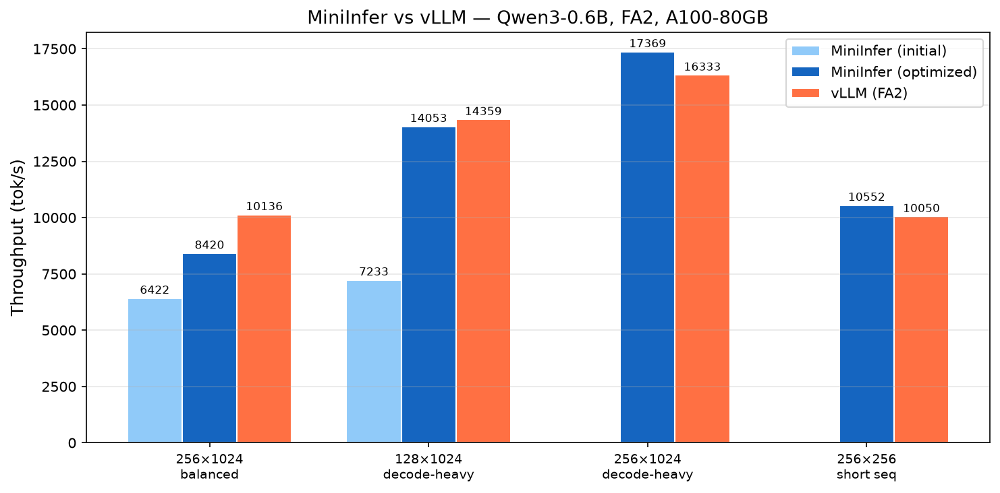

# MiniInfer

<div align="center">

[](https://www.python.org/downloads/)
[](https://pytorch.org/)
[](https://opensource.org/licenses/MIT)

**一个从零开始构建的轻量级高性能 LLM 推理引擎**

</div>

---

## 项目简介

MiniInfer 是一个学习性质的大语言模型推理引擎，从零实现了现代 LLM 推理系统的核心组件：Paged KV Cache、Continuous Batching、CUDA Graph、Overlap Scheduling、FlashAttention2/FlashInfer 双后端、多进程推理、Qwen3-MoE 支持。目标是在保持代码可读性的前提下，尽可能接近工业级推理框架（vLLM）的性能。

## 性能对比

### MiniInfer vs vLLM（Qwen3-0.6B, FA2, A100-80GB）

<div align="center">



</div>

### 初版 vs 优化后

| 负载 | MiniInfer 初版 | MiniInfer 优化后 | vLLM (FA2) |
|---|---|---|---|
| 256 seq × 1024 out（均衡） | 6,422 tok/s | **8,420 tok/s** | 10,136 tok/s |
| 128 seq × 1024 out（decode-heavy） | 7,233 tok/s | **14,053 tok/s** | 14,359 tok/s |
| 256 seq × 1024 out（decode-heavy） | KV 不足 | **17,369 tok/s** | 16,333 tok/s |
| 256 seq × 256 out（短序列） | — | **10,552 tok/s** | 10,050 tok/s |

> **decode-heavy 场景（长输出）MiniInfer 优化后反超 vLLM**；均衡负载的剩余差距在 prefill 阶段（eager，无 cuda graph），piecewise cuda graph 框架已就位待闭合。

### 优化历程

| 优化项 | 效果 |
|---|---|
| 消除 decode 热路径 boolean-index / allocator 同步 | CPU 1405ms → 778ms（+81% @32seq） |
| Sampler 分级路由（temp>0 用 flashinfer 融合采样） | 10× 快于 float32 Gumbel-max |
| 修复每步 O(seq_len) detokenization | decode-heavy 7,233 → 14,053 tok/s（+94%） |
| KV 利用率 0.6 → 0.9（与 vLLM 一致） | 256 seq × 长序列不再 KV 耗尽 |
| FlashInfer backend 修复（layout/page-index/graph） | 全规模正确，设为默认 backend |
| Overlap + CUDA-graph 流竞态修复 | `schedule_stream.wait_stream(forward_stream)` |

## 架构设计

```
                    ┌───────────────┐
  Client ──────────►│  LLMEngine    │
                    │  ├ Scheduler  │  Continuous Batching / Chunked Prefill
                    │  ├ ModelRunner│  CUDA Graph / Overlap / FA2+FlashInfer
                    │  ├ KVCacheMgr │  Paged KV Cache + Radix Cache
                    │  └ Detokenizer│  Offset-based Incremental Decode
                    └───────┬───────┘
                            │ use_multiprocess=True
                    ┌───────▼───────┐
                    │ MultiProcess  │  ZMQ ipc:// 流水线
                    │  Tokenizer    │  → Scheduler(EngineCore) → Detokenizer
                    └───────────────┘
```

### 核心组件

| 组件 | 文件 | 说明 |
|---|---|---|
| **LLMEngine** | `engine/llm_engine.py` | 单进程推理引擎入口，管理 Scheduler + ModelRunner + KVCache |
| **Scheduler** | `scheduler/scheduler.py` | Sarathi-Serve 风格 stall-free batching，支持 prefill/decode/mixed |
| **ModelRunner** | `engine/model_runner.py` | 模型前向 + 采样 + CUDA Graph |
| **KVCacheManager** | `kvcache/kv_cache_manager.py` | Paged KV Cache + Radix Prefix Cache |
| **OverlapExecutor** | `engine/overlap_executor.py` | SGLang 风格双 batch overlap（schedule_stream / forward_stream / copy_stream） |
| **CudaGraphRunner** | `engine/cuda_graph_runner.py` | Decode CUDA Graph 捕获/重放（power-of-2 batch size） |
| **MultiProcessEngine** | `engine/multi_process_engine.py` | 三进程 ZMQ 流水线（Tokenizer / EngineCore / Detokenizer） |
| **PiecewiseCudaGraph** | `engine/piecewise_cuda_graph.py` | Prefill piecewise cuda graph 框架（MoE-extensible，v1 默认关闭） |

### Attention Backend

| Backend | 说明 |
|---|---|
| **FlashAttention2** (`flash_attn_with_kvcache`) | paged decode，split-KV，page_size=256 |
| **FlashInfer** (`BatchDecodeWithPagedKVCacheWrapper`) | vLLM-grade paged decode，`use_cuda_graph=True`，无 page_size 约束 |

### 支持模型

| 模型 | 文件 | 说明 |
|---|---|---|
| Qwen2 | `models/fused_qwen2.py` | 融合 QKV / Gate-Up |
| Qwen3 | `models/fused_qwen3.py` | QK-Norm + 独立 head_dim |
| Qwen3-MoE | `models/fused_qwen3_moe.py` | FusedMoE（TP/EP 保留，去量化），移植自 nano-vllm |

### 推理模式

- **单进程**（`use_multiprocess=False`）：Scheduler + ModelRunner 同进程，overlap scheduling
- **多进程**（`use_multiprocess=True`）：Tokenizer / EngineCore / Detokenizer 三进程 ZMQ 流水线

## 快速开始

```python
from miniinfer.engine.llm_engine import LLMEngine
from miniinfer.utils import SamplingParams

with LLMEngine(
    model="/path/to/Qwen3-0.6B",
    max_num_seqs=256,
    max_model_len=4096,
) as engine:
    outputs = engine.generate(
        prompts=["Hello, how are you?"],
        sampling_params=SamplingParams(max_tokens=128, temperature=0.7),
    )
    print(outputs[0]["text"])
```

### 多进程模式

```python
with LLMEngine(
    model="/path/to/Qwen3-0.6B",
    use_multiprocess=True,   # 三进程 ZMQ 流水线
    max_num_seqs=256,
) as engine:
    outputs = engine.generate(prompts=["Hello"], sampling_params=SamplingParams(max_tokens=64))
```

### Benchmark

```bash
# MiniInfer
PYTHONPATH=. python benchmark/bench_miniinfer.py --model /path/to/model --num-seqs 256

# vLLM（FA2 公平对比）
VLLM_ATTENTION_BACKEND=FLASH_ATTN python benchmarks/benchmark_vllm.py --model /path/to/model
```

## 项目结构

```
miniinfer/
├── config/          # EngineConfig + 模型 Config（Qwen2/Qwen3/Qwen3-MoE）
├── engine/
│   ├── llm_engine.py          # 单进程引擎入口
│   ├── multi_process_engine.py # 多进程 ZMQ 驱动
│   ├── model_runner.py         # 模型前向 + 采样 + CUDA Graph
│   ├── cuda_graph_runner.py    # Decode CUDA Graph
│   ├── piecewise_cuda_graph.py # Prefill piecewise CG 框架（MoE-extensible）
│   ├── overlap_executor.py     # SGLang 风格 overlap scheduling
│   ├── detokenizer.py          # 增量 detokenize
│   ├── workers/                # 多进程 Worker（Tokenizer/Scheduler/Detokenizer）
│   └── ipc/                    # ZMQ IPC 协议 + 通道
├── layers/
│   ├── attention_backend/      # FA2 + FlashInfer 后端
│   ├── fused_moe/              # FusedMoE（grouped GEMM，TP/EP）
│   └── ...                     # RMSNorm / RoPE / Sampler / Embedding
├── models/                     # Qwen2 / Qwen3 / Qwen3-MoE
├── scheduler/                  # Continuous Batching + Chunked Prefill
├── kvcache/                    # Paged KV Cache + Radix Cache
├── loader/                     # 多线程权重加载
└── utils/                      # logger / crash_logger / profiler / sampling_params
```

## 致谢

- [vLLM](https://github.com/vllm-project/vllm) — PagedAttention、Continuous Batching
- [SGLang](https://github.com/sgl-project/sglang) — Overlap Scheduling、Radix Cache
- [nano-vllm](https://github.com/GeeeekExplorer/nano-vllm) — FusedMoE 实现、Logger 设计
- [FlashAttention](https://github.com/Dao-AILab/flash-attention) / [FlashInfer](https://github.com/flashinfer-ai/flashinfer) — Attention Kernel

## License

MIT
