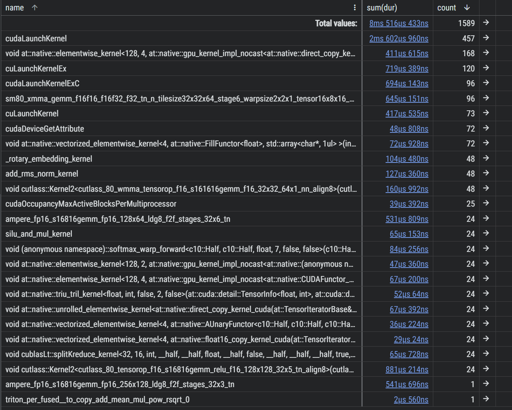
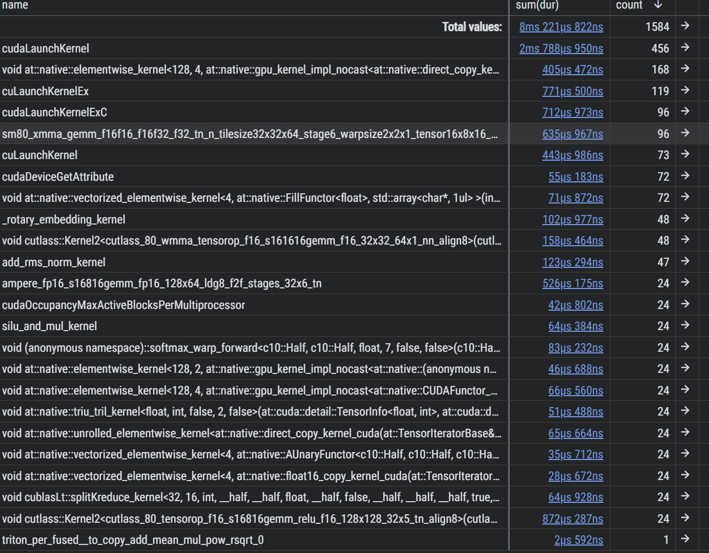
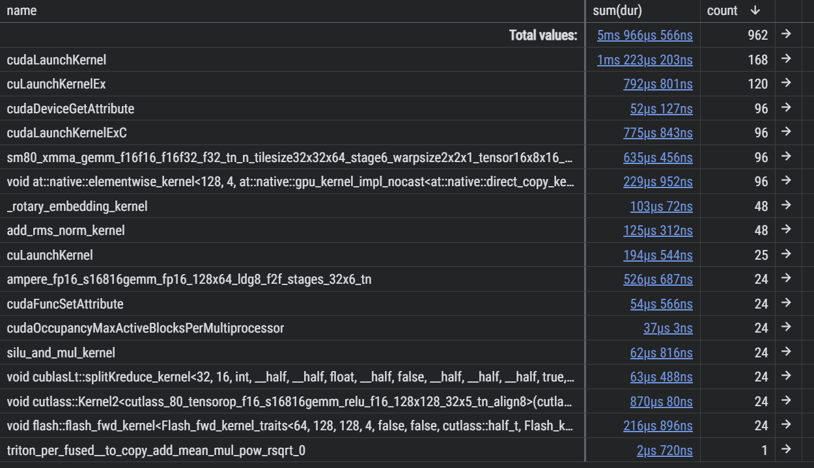

# Kernel-Fusion Benchmarks Report

## Baseline
使用 Pytorch 原生 Attention 和相关函数，没有实现算子融合
```python
python tests/profile/profile_qwen2.py --seq-len 128 --profile
```
### Result
```shell
========================================
Benchmark Results (No Cache)
========================================
               Metric  Value
      Sequence Length    128
     Avg Latency (ms) 33.240
     Std Latency (ms)  0.076
      Model Size (GB)  1.704
Est. Bandwidth (GB/s)  52.43
```

## First Optimization: Fused Qwen2

### Implemented Kernel Fusions and Triton Kernels
**Triton Kernels**
- RoPE triton kernel
- SiluAndMul triton kernel
- RmsNormAndAdd triton kernel

**Fused Kernels**
- RmsNorm + Add Fusion
- Fused Gate+Up GEMM(x @ [W_gate | W_up])
- SiluAndMul Kernel (SiLU(part1) * part2)
- LayerNorm + Last iter Add Fusion

```python
python tests/profile/profile_qwen2.py --seq-len 128 --profile
```

### Result 
```shell
========================================
Benchmark Results (No Cache)
========================================
               Metric  Value
      Sequence Length    128
     Avg Latency (ms) 28.660
     Std Latency (ms)  3.365
      Model Size (GB)  1.704
Est. Bandwidth (GB/s)  60.81
```


### Analysis

- 有很多小算子，考虑使用 torch.compile 进行优化
- CUDA Launch 过多，考虑后续重构框架后分为 prefill 和 decode 两个阶段进行优化


## Second Optimization: Torch Compile with Max Autotune


### Result

```shell
========================================
Benchmark Results (No Cache)
========================================
               Metric  Value
      Sequence Length    128
     Avg Latency (ms) 26.796
     Std Latency (ms)  1.023
      Model Size (GB)  1.704
Est. Bandwidth (GB/s)  65.03
```



### Analysis

- 仍然是 CUDA Launch 过多，这个需要后续重构框架后分为 prefill 和 decode 两个阶段进行优化
- 我们已经用 triton 对一些算子实现了融合，所以 torch compile 并没有带来太大的提升
- gemm 和 softmax 分开处理里面调用了多个小算子，增大了 kernel launch 次数，可以用 flash attention 进行优化

## Third Optimization: Flash Attention


### Result
```shell
========================================
Benchmark Results (No Cache)
========================================
               Metric  Value
      Sequence Length    128
     Avg Latency (ms) 24.588
     Std Latency (ms)  0.157
      Model Size (GB)  1.704
Est. Bandwidth (GB/s)  70.87
```



### Analysis

可以发现 flash attention 有效减少了 attention 相关的 kernel launch 次数，提升了整体的性能表现